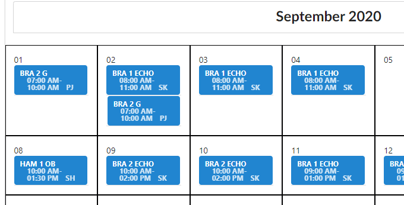
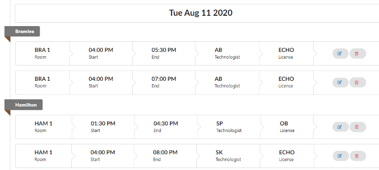
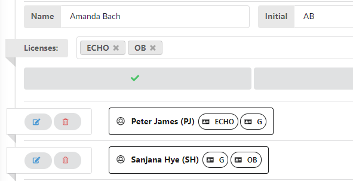
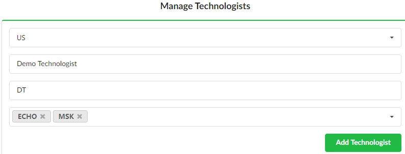
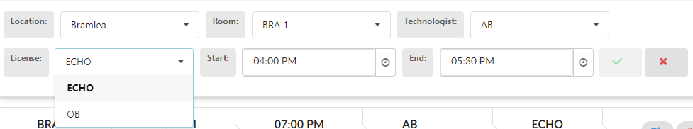
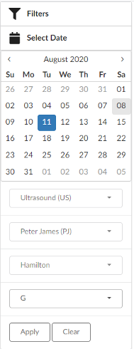

# DI Manager (2.0)

View Demo Here - [Demo](https://www.youtube.com/watch?v=NETeMjC1BBE)   

DI Manager is an application for healthcare organizations to build, customize , schedule and view filtered shifts in multi-site multi-room facility with various modalities, technologists, licenses with month and day based views.

## Features

- **Month View**: assign multiple shifts, edit, view and filter shifts for selected month

  

- **Day View**: view, assign, edit, view, and filter shifts for selected day

  

- **Resource Manager**: build and customize shifts, technologists, licenses, locations, rooms

  

  

- **Error Prevention**: Reducing user errors through client and server side validations and dynamic rendering of strictly valid options in forms.

  

- **Filter**: Comprehensive filtering options for both administrative and non-administrative users

  

